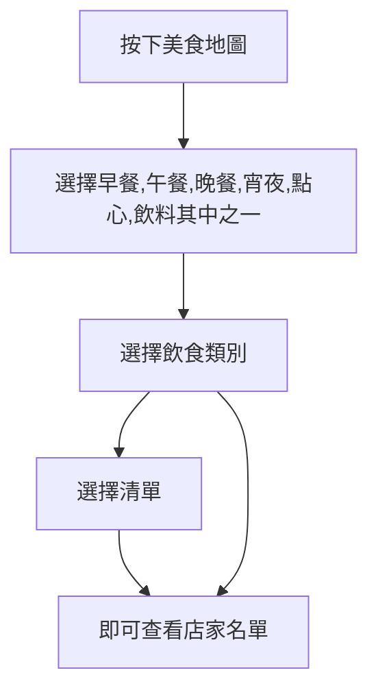

# 臺東助理-露娜，使用說明
###### tags: `聊天機器人`
---
<!-- css -->

<!-- css -->
### 初始畫面 
### 選單畫面 
---
# 簡介

#### 臺東助理-露娜，有六種功能，美食地圖、天氣小幫手、8129號公車查詢、部落神話小遊戲、選課推薦、使用說明，皆是實用且有趣的功能，以下為各功能詳細的說明，歡迎您來體驗看看喔！

---

<!-- 功能列 -->
功能
===
## 美食地圖
> 美食地圖使用說明流程

---
## 天氣小幫手
> 天氣小幫手使用說明畫面
#### 點擊天氣小幫手圖示 顯示台東地區當日(明日)天氣資訊
##### 天氣小幫手，每12小時更新一次，
##### 預估更新在8:00AM and 5:40PM
### 展示畫面

---

## 8129號公車查詢
> 公車查詢使用說明畫面
#### 點擊公車查詢圖示 顯示立即公車進站(到站)資訊

#### 起始分為森林遊樂區及台東轉運站方向
### 選擇方向
#### 點選方向完成後 顯示幾點發車 幾點到學校 幾點到火車站
#### 舉例: 17:20 台東大學 代表未發車 並且在下午五點二十分將抵達台東大學
#### 舉例: 16分 台東大學 代表已經發車 並且當下時間+16分鐘抵達台東大學
### 結果展示

---

## 部落神話小遊戲
> 小遊戲遊玩說明
#### 點擊小遊戲的圖示即可開始遊戲
#### 在聊天室輸入對話進行互動
---

## 選課推薦
> 選課推薦使用說明畫面
#### 聊天室輸入範例:
#### 大一通識推薦
#### 向度二推薦
#### 自然科學領域推薦
#### 東大Dcard好文推薦
#### Dcard台東大學版連結
#### 或是你感興趣的課程---例如:
#### 理財與人生規劃(羅炳和)評論
#### 幻想文學(曾瑞華)評論
#### tips:輸入的文字不一定要完全正確，只要有相關性，知識庫裡有的都會回應歐~!

---

## 使用說明

#### 按下去就帶你來到這邊~
---

作者的話
===
#### 大家好，我們是57小組，
#### 希望藉由linebot聊天機器人，
#### 使生活更得更方便、簡潔。
#### 最後，希望使用者可以給個feedback！
#### 如果您還要什麼樣的功能，歡迎寫信到
#### mailto:10812122@gm.nttu.edu.tw
#### 敬請不吝指教！
